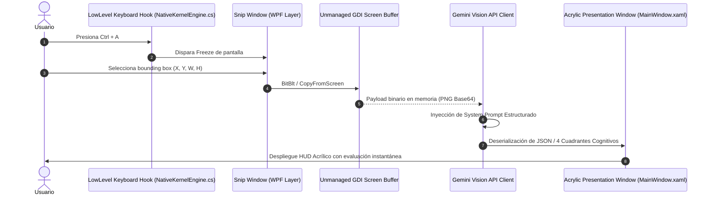

# 📋 DOSSIER EJECUTIVO, ARQUITECTURA TÉCNICA Y MANIFIESTO ESTRATÉGICO
## Tooltip AI — Cognitive Screen Inspector & Assisted Decision Engine for Windows 11
**Código de Proyecto:** TeachMe AI / Tooltip AI  
**Organización Desarrolladora:** Dixi3 Labs  
**Versión de Documento:** 2.0 (Enterprise & Store Release Standard)  
**Entorno Operativo:** Windows 11 / Windows 10 (Arquitectura x64 Desktop Bridge)

---

## 📑 ÍNDICE GENERAL
1. [Manifiesto de Ingeniería y Principios Fundamentales](#1-manifiesto-de-ingeniería-y-principios-fundamentales)
2. [Declaración del Problema y Oportunidad de Mercado](#2-declaración-del-problema-y-oportunidad-de-mercado)
3. [Propuesta de Valor y Ventajas Competitivas](#3-propuesta-de-valor-y-ventajas-competitivas)
4. [Especificación de Arquitectura y Pipeline de Datos](#4-especificación-de-arquitectura-y-pipeline-de-datos)
5. [Estrategia de Monetización, Viabilidad y Sostenibilidad Financiera](#5-estrategia-de-monetización-viabilidad-y-sostenibilidad-financiera)
6. [Roadmap Técnico de Innovación (Fases de Implementación)](#6-roadmap-técnico-de-innovación-fases-de-implementación)
7. [Manual Operativo de Mantenimiento, Sintaxis y Empaquetado](#7-manual-operativo-de-mantenimiento-sintaxis-y-empaquetado)
8. [Executive Summary / Ficha Institucional](#8-executive-summary--ficha-institucional)

---

## 1. MANIFIESTO DE INGENIERÍA Y PRINCIPIOS FUNDAMENTALES

Tooltip AI se concibe bajo el paradigma de **Software de Utilidad Esbelta (Lean Desktop Utility)** e **Inferencia de Borde Asistida (Edge-Assisted Cognition)**. Frente a la saturación de aplicaciones hipertrofiadas que degradan el rendimiento del sistema operativo, este proyecto establece cinco pilares no negociables de diseño:

### 1.1. Cero Fricción Operativa (Zero-Friction UX)
La herramienta no debe obligar al usuario a abandonar su flujo de trabajo. Debe activarse de forma omnicanal mediante un atajo global estandarizado (`Ctrl + A`), permitiendo la captura, procesamiento y despliegue del análisis en menos de 2 segundos sin abrir ventanas de navegación externas.

### 1.2. Huella de Memoria Determinista (<40 MB RAM)
El núcleo del software se implementa directamente sobre código compilado nativo en C# .NET 8 con interoperabilidad Win32 (GDI/User32). Queda descartado el uso de entornos web empaquetados pesados (como Chromium/Electron) para el proceso residente, garantizando un impacto casi nulo en la autonomía de batería y uso de memoria de trabajo.

### 1.3. Didáctica Estructurada y Mitigación de Riesgos
La inteligencia artificial no debe limitarse a responder preguntas genéricas; debe **clasificar el impacto de la interfaz en cuatro dimensiones operativas:**
1. *Nivel de Riesgo Operativo* (Inocuo • Precaución • Crítico).
2. *Explicación Funcional Accesible* (Traducción conceptual sin jerga innecesaria).
3. *Impacto Técnico Subyacente* (Efecto en Registro, Memoria, Red o Arranque del SO).
4. *Diagnóstico y Remedio Técnico* (Scripts de verificación Win32/PowerShell).

### 1.4. Privacidad y Seguridad por Diseño (Privacy by Design)
* Las consultas visuales son efímeras y no se almacenan en servidores intermediarios de terceros.
* Toda la comunicación se realiza mediante canales cifrados TLS 1.3 directamente contra la API oficial del proveedor del modelo fundacional (Google Gemini Enterprise APIs).
* Las credenciales locales se persisten en el perfil del usuario mediante el subsistema criptográfico nativo de Windows (DPAPI).

### 1.5. No Intrusividad Sistémica
La utilidad opera como un proceso de fondo silencioso en el System Tray de Windows. No realiza telemetría invasiva, no muestra publicidad emergente y no altera claves de arranque del sistema sin la autorización expresa del usuario.

---

## 2. DECLARACIÓN DEL PROBLEMA Y OPORTUNIDAD DE MERCADO

### 2.1. El Dolor: Fatiga de Decisión e Inseguridad Operativa en el Escritorio
El usuario moderno interactúa diariamente con interfaces críticas que contienen:
* **Mensajes de error crípticos:** Códigos hexadecimales (`0x80004005`, `HRESULT`) que carecen de contexto práctico.
* **Opciones ambiguas de configuración:** Casillas de verificación en instaladores, políticas de privacidad o herramientas de mantenimiento que pueden comprometer la integridad del sistema o derivar en la instalación de adware.
* **Interfaces densas especializadas:** Suites de desarrollo, software ERP, software contable o herramientas CAD con cientos de comandos abreviados que aumentan la curva de aprendizaje y ralentizan la productividad.

### 2.2. La Ineficiencia de los Métodos Actuales
| Flujo Actual | Impacto Negativo |
| :--- | :--- |
| Tomar captura con Recortes (`Win+Shift+S`) | Fragmentación del flujo de trabajo. |
| Abrir navegador web y buscador | Pérdida de foco y tiempo promedio de 3 a 5 minutos. |
| Contrastar información en foros técnicos | Riesgo de aplicar soluciones obsoletas o comandos dañinos. |

**Tooltip AI colapsa este ciclo en un único paso de 1.5 segundos directamente sobre la superficie visual del problema.**

---

## 3. PROPUESTA DE VALOR Y VENTAJAS COMPETITIVAS

```
┌────────────────────────────────────────────────────────────────────────┐
│                        MATRIZ DE DIFERENCIACIÓN                        │
├──────────────────────┬────────────────────────┬────────────────────────┤
│ Atributo             │ Software Tradicional   │ Tooltip AI             │
├──────────────────────┼────────────────────────┼────────────────────────┤
│ Latencia de análisis │ 180 - 300 segundos     │ < 2 segundos           │
│ Huella de RAM        │ 250 MB - 900 MB        │ < 40 MB                │
│ Marco de diseño      │ Diálogos Win32 clásicos│ Fluent Mica / VisionOS │
│ Intermediarios Cloud │ Servidores propietarios│ Direct-to-Provider API │
│ Formato de salida    │ Texto libre no guiado  │ Matriz de 4 cuadrantes │
└──────────────────────┴────────────────────────┴────────────────────────┘
```

---

## 4. ESPECIFICACIÓN DE ARQUITECTURA Y PIPELINE DE DATOS



### 4.1. Módulos Críticos del Código Fuente:
* **`src-dotnet/NativeKernelEngine.cs`:**  
  Interoperabilidad nativa con `user32.dll` implementando `SetWindowsHookEx` con los identificadores `WH_KEYBOARD_LL` y `WH_MOUSE_LL`. Incorpora soporte por monitor para escalado dinámico de alta densidad (DPI Awareness Per-Monitor v2).
* **`src-dotnet/SnippingWindow.xaml.cs`:**  
  Capa gráfica acelerada por hardware que congela el fotograma visual activo y provee una guía milimétrica de selección sin retraso de refresco.
* **`src-dotnet/GeminiClient.cs`:**  
  Mapeador HTTP asíncrono configurado sobre `SocketsHttpHandler` con optimización de reuso de sockets para inferencia multimodal contra modelos `gemini-2.5-flash`.
* **`src-dotnet/MainWindow.xaml`:**  
  Interfaz de usuario basada en XAML con efecto acrílico de doble capa (*Backdrop Acrylic Brush*), optimizada ergonómicamente para no obstruir el punto de interés analizado.

---

## 5. ESTRATEGIA ECONÓMICA Y ARQUITECTURA DE NEGOCIO: MODELO BYOK Y EVOLUCIÓN SAAS

Para conciliar rentabilidad financiera, viabilidad operativa a largo plazo y adopción masiva sin barreras artificiales, el modelo de negocio de Tooltip AI se estructura en torno a una **Estrategia de Captura de Doble Mercado (Dual-Market Architecture)**:

```
┌──────────────────────────────────────────────────────────────────────────────┐
│                    ARQUITECTURA DE NEGOCIO DE DOBLE MERCADO                  │
├──────────────────────────────────────┬───────────────────────────────────────┤
│ MERCADO A: USUARIOS TÉCNICOS & PROS  │ MERCADO B: USUARIOS GENERALES & B2B   │
├──────────────────────────────────────┼───────────────────────────────────────┤
│ Modelo: Bring Your Own Key (BYOK)    │ Modelo: Turnkey SaaS ("Llave en Mano")│
│ Precio: Compra Única ($2.69 USD)     │ Precio: Suscripción ($300-$400 MXN/m) │
│ Infraestructura: Cero costo para dev │ Infraestructura: Servidores Dixi3 Labs│
│ Margen Bruto: ~85% neto (post-Store) │ Margen Bruto: ~60-70% neto recurrente │
│ Target: Devs, SysAdmins, Power Users │ Target: PyMEs, no técnicos, Helpdesk  │
└──────────────────────────────────────┴───────────────────────────────────────┘
```

### 5.1. Viabilidad Financiera y Ventajas del Modelo BYOK (Bring Your Own Key)
1. **Margen de Beneficio Real Inmune al Consumo de Tokens:**  
   Al delegar la cuota de inferencia de `gemini-2.5-flash` directamente a la cuenta del usuario, el ingreso derivado de la licencia (pago único accesible de $2.69 USD menos la comisión estándar del 12-15% de Microsoft Store) representa **ganancia neta inmediata**.
   * *Mitigación de Riesgo de Quiebra:* En un SaaS convencional con precio plano, un usuario intensivo que ejecuta 5,000 análisis mensuales puede superar con creces el costo del servicio. Bajo el modelo BYOK, el costo marginal por consulta para Dixi3 Labs es **estrictamente $0.00 USD**.
2. **Privacidad Absoluta como Diferenciador Competitivo:**  
   La telemetría y los recortes visuales viajan exclusivamente de forma cifrada entre el cliente local y la infraestructura de Google. Dixi3 Labs no almacena capturas ni datos personales en servidores intermedios, simplificando radicalmente el cumplimiento de normativas de privacidad (GDPR, CCPA, leyes locales).
3. **Seguridad Criptográfica Integrada:**  
   La API Key se almacena localmente mediante la API de Protección de Datos de Windows (`DPAPI` vía `VaultManager`), garantizando aislamiento total entre usuarios y protección frente a malware no privilegiado.

### 5.2. Mitigación de la Fricción de Onboarding en el Modelo BYOK
El principal desafío del modelo BYOK es la fricción de entrada: un desarrollador genera una API Key en Google AI Studio en 30 segundos, pero un usuario promedio de Windows puede percibirlo como una barrera técnica y abandonar la aplicación.

#### Solución de Mitigación en Interfaz (UX/UI en XAML):
* **Acceso Guiado en 1 Clic (*Deep-Link Guided Onboarding*):**  
  Inclusión de un botón de acción rápida en el cajón de ajustes (`HudWindow.xaml`):  
  `[ 🔑 Obtener Clave Gratuita en Google AI Studio ↗ ]`  
  que invoca el navegador predeterminado apuntando directamente a `https://aistudio.google.com/app/apikey`.
* **Micro-Tutorial Visual Integrado (3 Pasos):**  
  1. *Paso 1:* Clic en "Crear API Key" (con cualquier cuenta de Google existente).  
  2. *Paso 2:* Copiar la clave generada (prefijo `AIzaSy...`).  
  3. *Paso 3:* Pegar en Tooltip AI y presionar "Guardar Clave".
* **Validación Sintáctica y Diagnóstico en Tiempo Real:**  
  El control de texto valida localmente el patrón `AIzaSy` y provee un botón de *"Probar Conexión"* que efectúa un ping de bajo costo para certificar la validez de la credencial antes del primer uso.

### 5.3. Evolución hacia el Modelo Híbrido: Nivel "Llave en Mano" (Turnkey SaaS)
Para la **Fase de Diversificación (Q2)**, Tooltip AI habilitará el nivel **SaaS Administrado**:

1. **La Propuesta "Cero Configuración" ($300 a $400 MXN mensuales / ~$15 a $20 USD):**  
   Orientado a usuarios corporativos, ejecutivos y personas no técnicas que prefieren una experiencia transparente sin gestión de claves. La aplicación se auto-autentica contra un API Gateway seguro administrado por Dixi3 Labs con balanceo de carga y cuotas empresariales.
2. **Abstracción Arquitectónica en Código (`IInferenceProvider`):**  
   El motor en C# desacopla la capa de transporte mediante un patrón de inyección de dependencias:
   * `ByokDirectProvider`: Comunicación directa cliente -> Google Gemini API (costo operativo cero).
   * `TurnkeyProxyProvider`: Comunicación cliente -> API Gateway Dixi3 Labs -> Google Gemini Enterprise.
3. **Mecanismos Complementarios (Microsoft Store Add-ons):**  
   * **Tier de Patrocinio Voluntario:** Aportaciones únicas de $1.99 a $4.99 USD para apoyar el desarrollo independiente.  
   * **Módulo de Documentación Técnica:** Exportación de diagnósticos con evidencia gráfica a Markdown/PDF para tickets de soporte técnico.  
   * **Paquete Pro de Accesibilidad:** Lectura por voz sintetizada en tiempo real.

---

## 6. ROADMAP TÉCNICO DE INNOVACIÓN (FASES DE IMPLEMENTACIÓN)

### 🟢 Fase 1: Consolidación y Accesibilidad (Meses 1–2)
* **Certificación y Publicación Oficial en Microsoft Store:** Culminación del proceso de revisión activa.
* **Integración del Motor de Voz (TTS):** Implementación de `System.Speech.Synthesis` y soporte para voces neuronales de Windows.
* **Parametrización del Radar de Reposo (Dwell Engine):** Panel de configuración de milisegundos de descanso de cursor para activación automática.

### 🟡 Fase 2: Auditoría Local y Memoria de Diagnóstico (Meses 3–4)
* **Cuaderno Cognitivo Local (Local Knowledge Base):**  
  Indexación cifrada en disco de diagnósticos previos para detección de patrones repetitivos en el sistema operativo del usuario.
* **Integración de Compras Integradas (Store In-App Purchases):**  
  Implementación de la biblioteca `Windows.Services.Store` en el núcleo C# para activar complementos de productividad de forma nativa.

### 🟣 Fase 3: Inferencia Híbrida Local y Automatización Asistida (Meses 5–8)
* **Motor Offline (Small Language Models - SLM):**  
  Incorporación opcional de modelos locales compactos (vía ONNX Runtime o servidor local Ollama) para operar en entornos corporativos o sin conexión a internet.
* **Action Engine con Elevación Segura de Privilegios:**  
  Generación y ejecución asistida (con confirmación de UAC de Windows) de comandos de remediación en PowerShell directamente desde la interfaz.

---

## 7. MANUAL OPERATIVO DE MANTENIMIENTO, SINTAXIS Y EMPAQUETADO

### 7.1. Compilación de Release Autocontenido de Alto Rendimiento
Comando PowerShell para generar los binarios sin dependencias de runtime externo:
```powershell
dotnet publish src-dotnet/TeachMeAI.csproj `
    -c Release `
    -r win-x64 `
    --self-contained true `
    /p:PublishSingleFile=true `
    /p:IncludeNativeLibrariesForSelfExtract=true `
    /p:DebugType=None
```

### 7.2. Pipeline de Empaquetado MSIX para Nuevas Versiones de Store
1. Actualizar el elemento `<Version>` en `src-dotnet/TeachMeAI.csproj` (ej. `1.0.1.0`).
2. Ejecutar el empaquetador oficial del proyecto:
```powershell
cd "d:\TeachMe AI\MicrosoftStore_Submission\Scripts"
.\build-msix.bat
```
3. El instalador certificado se deposita automáticamente en:
   `MicrosoftStore_Submission/Package/ToolTipAIAssistant_1.0.x.0_x64.msix`

### 7.3. Patrón de Gestión de Memoria para Operaciones Gráficas Intensivas
Regla de implementación estricta para garantizar que el consumo se mantenga <40 MB RAM mediante liberación determinista de identificadores GDI (`HBITMAP`, `HDC`):

```csharp
public static byte[] CaptureScreenRegionClean(Rectangle region)
{
    using var bitmap = new Bitmap(region.Width, region.Height, PixelFormat.Format32bppArgb);
    using (var graphics = Graphics.FromImage(bitmap))
    {
        graphics.CopyFromScreen(region.Left, region.Top, 0, 0, region.Size, CopyPixelOperation.SourceCopy);
    }
    
    using var stream = new MemoryStream();
    bitmap.Save(stream, ImageFormat.Png);
    return stream.ToArray();
}
```

### 7.4. Almacenamiento Criptográfico Seguro de Credenciales (DPAPI)
Para el resguardo de claves de API y configuraciones confidenciales del usuario:

```csharp
using System.Security.Cryptography;
using System.Text;

public static class VaultManager
{
    public static void StoreKey(string key, string targetPath)
    {
        var rawBytes = Encoding.UTF8.GetBytes(key);
        var cipherText = ProtectedData.Protect(rawBytes, null, DataProtectionScope.CurrentUser);
        File.WriteAllBytes(targetPath, cipherText);
    }

    public static string RetrieveKey(string targetPath)
    {
        if (!File.Exists(targetPath)) return string.Empty;
        var cipherText = File.ReadAllBytes(targetPath);
        var rawBytes = ProtectedData.Unprotect(cipherText, null, DataProtectionScope.CurrentUser);
        return Encoding.UTF8.GetString(rawBytes);
    }
}
```

---

## 8. EXECUTIVE SUMMARY / FICHA INSTITUCIONAL

* **Nombre Oficial:** Tooltip AI (Registrado en Microsoft Store como *ToolTip AI Assistant*)
* **Propósito:** Copiloto cognitivo visual de ultra-baja latencia para la interpretación didáctica de interfaces, mitigación de errores de configuración y asistencia técnica instantánea en Windows 11.
* **Propiedad Intelectual:** Dixi3 Labs
* **Diferenciador Tecnológico:** Inferencia multimodal directa (`gemini-2.5-flash`) combinada con arquitectura compilada nativa Win32 C# (.NET 8), entrega de respuesta en <2 segundos y consumo de recursos inferior a 40 MB de memoria de trabajo.
* **Modelo Operativo:** Adopción abierta respaldada por extensiones de productividad bajo demanda y reinversión para el desarrollo continuo de herramientas de software de vanguardia.
