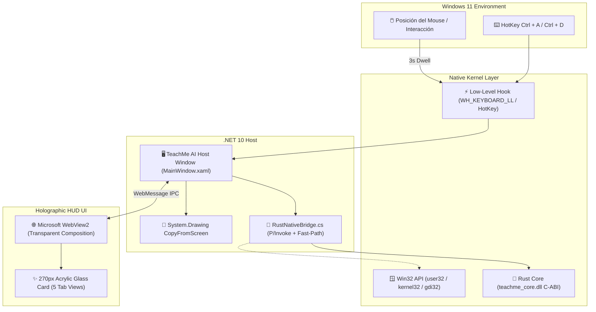

<div align="center">


# 🧠 TeachMe AI
### Windows 11 Neural Screen Inspector & Cognitive HUD

[](https://dixi3stdgdl-design.github.io/TeachMe-AI/)
[](https://microsoft.com)
[](https://www.rust-lang.org/)
[](https://dotnet.microsoft.com/)
[](LICENSE)

<p align="center">
  <b>Utilidad de escritorio de ultra-bajo consumo que analiza cualquier ventana, diálogo de error o interfaz en Windows 11 en tiempo real mediante IA didáctica, atajos limpios y un HUD acrílico translúcido flotante alojado en la barra de tareas.</b>
</p>

</div>

---

## 🌟 Características Principales

- **⚡ Recorte Instantáneo Global (<kbd>Ctrl</kbd> + <kbd>A</kbd>):**
  Interrupción limpia mediante hook de sistema operativo (`WH_KEYBOARD_LL` y `RegisterHotKey`) que congela la pantalla en cualquier aplicación permitiendo seleccionar un área de interés milimétrica sin bloquear la escritura de mayúsculas.
- **📸 Captura de Pantalla Completa & Portapapeles:**
  Nuevas herramientas integradas para analizar la pantalla entera de un solo clic o examinar directamente imágenes y texto copiados al portapapeles.
- **🔽 Integración en la Barra de Tareas (System Tray):**
  TeachMe AI se aloja silenciosamente en la bandeja del sistema junto al reloj con un menú contextual completo y acceso rápido.
- **📡 Radar Automático On/Off (<kbd>Ctrl</kbd> + <kbd>D</kbd>):**
  Temporizador de descanso de ratón conmutables a voluntad para evitar sobrecarga o falsas ejecuciones en el escritorio.
- **🤖 Tutor Didáctico con Google Gemini Oficial:**
  Soporte para los últimos modelos `gemini-flash-latest` y `gemini-pro-latest` sin límites artificiales y con diagnóstico local de alta velocidad.
- **🪟 HUD Acrílico Translúcido (VisionOS / Raycast Grade):**
  Panel ultracompacto con opacidad calibrada, desenfoque dinámico y tipografía ergonómica de lectura confortable (`Plus Jakarta Sans` y `JetBrains Mono`).

---

## 🏗️ Diagrama de Arquitectura



---

## 📁 Estructura del Proyecto

```text
TeachMe AI/
├── src-rust/                      # Núcleo de bajo nivel en Rust
│   ├── Cargo.toml                 # Configuración cdylib + windows-rs
│   └── src/
│       └── lib.rs                 # Exports C-ABI (WindowFromPoint, BitBlt, PIDs)
├── src-dotnet/                    # Aplicación Host en C# / .NET 10 WPF
│   ├── TeachMeAI.csproj           # Configuración con System.Drawing 10.0.11 + WebView2
│   ├── app.manifest               # DPI Awareness PerMonitorV2
│   ├── MainWindow.xaml            # Ventana transparente de superposición
│   ├── MainWindow.xaml.cs         # Inicialización, IPC y captura de pantalla
│   ├── RustNativeBridge.cs        # Cargador dinámico de Rust con Win32 fallback
│   ├── GlobalHotKey.cs            # Hook de teclado global (Shift+A / Alt+A)
│   └── wwwroot/                   # Interfaz HUD distribuida con la app
│       ├── index.html             # Estructura del HUD y visor de recorte
│       ├── styles.css             # Estilos Fluent Acrylic y micro-animaciones
│       └── app.js                 # Lógica de estados, radar dwell y comunicación IPC
├── build.bat                      # Script de compilación automatizada Rust + .NET
├── run.bat                        # Lanzador directo en Windows
├── .gitignore                     # Filtros de exclusión para Git
└── README.md                      # Documentación del proyecto
```

---

## ⌨️ Atajos de Teclado y Gestos

| Atajo / Gesto | Función | Comportamiento |
| :--- | :--- | :--- |
| <kbd>Shift</kbd> + <kbd>A</kbd> | **Recorte Instantáneo** | Congela la pantalla en cualquier aplicación y activa el cursor de precisión. |
| <kbd>Ctrl</kbd> + <kbd>Shift</kbd> + <kbd>A</kbd> | **Recorte Alternativo** | Atajo compatible con editores de código y suites 3D. |
| <kbd>Espacio</kbd> | **Saltar Espera** | Abre el panel inmediatamente mientras el radar de 3s está activo. |
| <kbd>Esc</kbd> | **Cancelar / Cerrar** | Cancela el recorte en curso o desvanece el panel HUD. |
| **Hover 3.0s** | **Dwell Activo** | Inicia el escaneo automático del elemento bajo el cursor. |
| **Icono 📌** | **Fijar Panel** | Ancla el HUD para lectura continua sin que desaparezca al mover el ratón. |

---

## 🚀 Requisitos y Compilación

### Requisitos Previos
- **Sistema Operativo:** Windows 10 (1809+) o Windows 11 (Recomendado).
- **.NET SDK:** .NET 8.0 o superior (compatible con paquetes .NET 10 Preview).
- **WebView2 Runtime:** Incluido de forma nativa en Windows 11.
- **Rust Toolchain (Opcional):** Si deseas recompilar `teachme_core.dll` con `cargo`. Si no está instalado, la app ejecuta su Fast-Path Win32 nativo integrado automáticamente.

### Compilación Rápida (Scripts Incluidos)

1. **Compilar todo el proyecto (Rust + .NET):**
   ```cmd
   build.bat
   ```

2. **Ejecutar la aplicación:**
   ```cmd
   run.bat
   ```

### Compilación Manual vía CLI

```powershell
# 1. (Opcional) Compilar Crate de Rust
cd src-rust
cargo build --release
cd ..

# 2. Compilar y Ejecutar Host en .NET
dotnet run --project "src-dotnet\TeachMeAI.csproj"
```

---

## 📜 Licencia

Distribuido bajo la Licencia **MIT**. Consulta el archivo `LICENSE` para más información.

<div align="center">
  <sub>Desarrollado con ❤️ para la comunidad de ingeniería de software y diseño en Windows 11.</sub>
</div>
