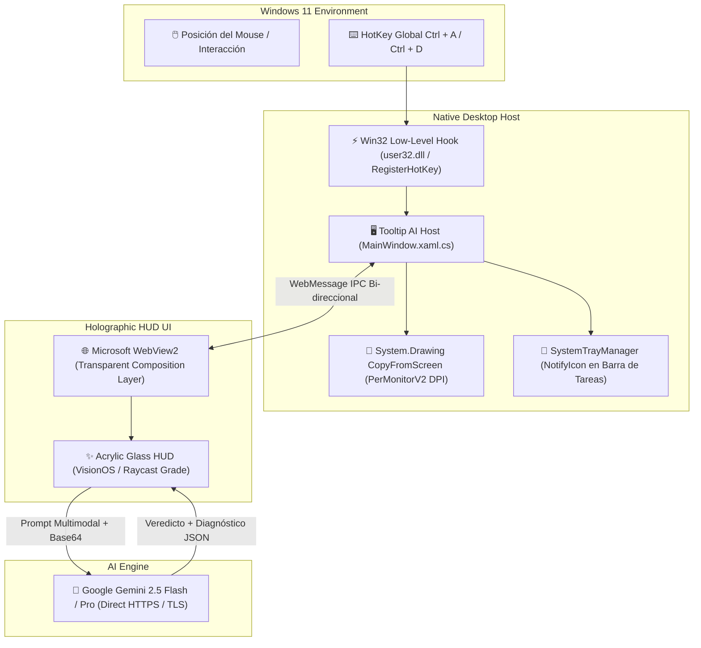

<div align="center">


# 🧠 ToolTip AI
### Inspector de pantalla con IA didáctica para Windows 11

[](https://dixi3stdgdl-design.github.io/TeachMe-AI/)
[](https://dixi3stdgdl-design.github.io/TeachMe-AI/)
[](https://dixi3stdgdl-design.github.io/TeachMe-AI/downloads/TooltipAI.exe)
[](https://dotnet.microsoft.com/)
[](LICENSE)

<p align="center">
  <b>Utilidad de escritorio para Windows 11 que explica botones, diálogos y errores con IA didáctica (Google Gemini, tu propia clave). Recorte global con <kbd>Ctrl</kbd>+<kbd>Shift</kbd>+<kbd>A</kbd>, HUD flotante y bandeja del sistema.</b>
</p>

</div>

---

## ⚡ Descarga e Instalación

### 1. Descarga Directa (Binario Standalone)
* 📥 **[Descargar ToolTip AI v1.0.2.0 para Windows 11 (.exe)](https://dixi3stdgdl-design.github.io/TeachMe-AI/downloads/TooltipAI.exe)**
* Compilado `win-x64 --self-contained`. Ejecuta y se aloja en la bandeja del sistema.

### 2. Microsoft Store
* **Partner Center ID:** `2f19281b-3d22-4767-9246-e6fe7d6e2d8a`
* Versión de reenvío limpia: **1.0.2.0** (atajos no conflictivos, branding unificado, vault DPAPI).

---

## 🌟 Características Principales

- **⚡ Recorte global (`Ctrl+Shift+A`):** congela la pantalla y permite seleccionar un área sin robar `Ctrl+A` (Seleccionar todo).
- **🪟 HUD flotante:** panel con veredicto, explicación en lenguaje llano, impacto y chat de seguimiento.
- **🤖 IA multi-proveedor (BYOK):** Gemini, OpenAI, Azure OpenAI, OpenRouter o Claude. Tú aportas la clave; se cifra con DPAPI local.
- **📸 Pantalla completa y portapapeles:** analiza capturas o texto copiado.
- **🔽 Bandeja del sistema:** presencia discreta; sin autoarranque forzado.
- **🔒 Clave cifrada localmente:** DPAPI de Windows (`ProtectedData`). Sin backend intermedio de capturas de Dixi3 Lqbs. El análisis va a la API de Google que configures.

---

## ⌨️ Atajos de Teclado

| Atajo | Función |
| :--- | :--- |
| <kbd>Ctrl</kbd>+<kbd>Shift</kbd>+<kbd>A</kbd> | Recorte y análisis |
| <kbd>Ctrl</kbd>+<kbd>Shift</kbd>+<kbd>D</kbd> | Radar dwell On/Off (off por defecto) |
| <kbd>Ctrl</kbd>+<kbd>Shift</kbd>+<kbd>C</kbd> | Ajustes |
| <kbd>Esc</kbd> | Cerrar / cancelar |
| **Hover (si radar activo)** | Análisis al reposar el cursor |

---

## 🏗️ Diagrama de Arquitectura



---

## 📁 Estructura del Repositorio

```text
TeachMe AI/
├── src-dotnet/                          # Aplicación de escritorio C# / .NET 8 WPF
│   ├── TeachMeAI.csproj                 # Configuración del proyecto WPF standalone
│   ├── MainWindow.xaml                  # Ventana acrílica de superposición
│   ├── MainWindow.xaml.cs               # Lógica de captura, hotkeys y WebView2 IPC
│   ├── GlobalHotKey.cs                  # Registrador de atajos de sistema Win32
│   ├── SystemTrayManager.cs             # Gestor de bandeja de sistema (System Tray)
│   ├── StartupManager.cs                # Administrador de arranque opcional en Windows
│   └── wwwroot/                         # Interfaz gráfica Fluent/VisionOS del HUD
├── MicrosoftStore_Submission/           # Kit Oficial para Microsoft Partner Center
│   ├── Package/
│   │   ├── TooltipAI.exe                # Ejecutable standalone de 72.4 MB
│   │   └── TooltipAI_1.0.0.0_x64.msix   # Paquete MSIX firmado
│   ├── Store_Assets/                    # Logos exactos (1080x1080, 2160x2160) y Screenshots
│   └── METADATOS_FICHA_TIENDA.md        # Textos y descripciones oficiales
├── downloads/
│   └── TooltipAI.exe                    # Binario servido directamente por CDN Fastly
├── index.html                           # Landing Page interactiva con simulador en vivo
├── privacy.html                         # Política de Privacidad oficial
├── LICENSE                              # Licencia MIT
└── README.md                            # Documentación del proyecto
```

---

## 🛠️ Compilación desde el Código Fuente

Si deseas compilar la aplicación tú mismo:

### Requisitos
- Windows 10 (1809+) o Windows 11.
- [.NET 8 SDK](https://dotnet.microsoft.com/download/dotnet/8.0) instalado.

### Comandos de Compilación
```powershell
# 1. Clonar el repositorio
git clone https://github.com/dixi3stdgdl-design/TeachMe-AI.git
cd TeachMe-AI

# 2. Compilar binario autónomo de archivo único (Self-contained)
dotnet publish src-dotnet/TeachMeAI.csproj -c Release -r win-x64 --self-contained true -p:PublishSingleFile=true -o ./dist

# 3. Ejecutar
.\dist\TooltipAI.exe
```

---

## 📜 Licencia y Privacidad

Distribuido bajo la Licencia **MIT**. Consulta el archivo [LICENSE](LICENSE) y nuestra [Política de Privacidad](privacy.html) para más detalles.

<div align="center">
  <sub>Desarrollado con ❤️ para los usuarios y entusiastas de Windows 11.</sub>
</div>
