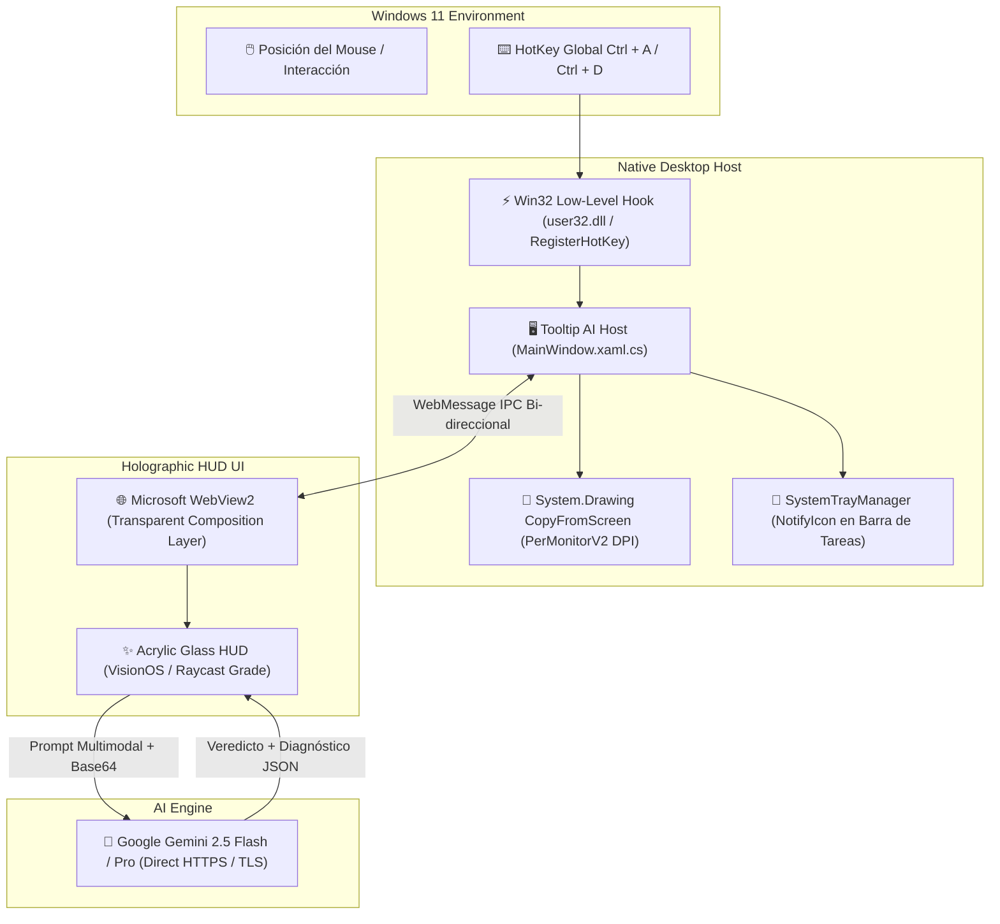

<div align="center">


# 🧠 Tooltip AI
### Windows 11 Neural Screen Inspector & Cognitive HUD

[](https://dixi3stdgdl-design.github.io/TeachMe-AI/)
[](https://dixi3stdgdl-design.github.io/TeachMe-AI/)
[-10B981?style=for-the-badge&logo=windows&logoColor=white)](https://dixi3stdgdl-design.github.io/TeachMe-AI/downloads/TooltipAI.exe)
[](https://dotnet.microsoft.com/)
[](LICENSE)

<p align="center">
  <b>Utilidad nativa ultraligera para Windows 11 que analiza cualquier ventana, botón o diálogo de error en tiempo real con IA didáctica multimodal (Google Gemini), recorte instantáneo global (<kbd>Ctrl</kbd> + <kbd>A</kbd>) y un HUD acrílico translúcido flotante.</b>
</p>

</div>

---

## ⚡ Descarga e Instalación

### 1. Descarga Directa (Binario Oficial Standalone)
Puedes descargar la versión lista para usar sin necesidad de instalar .NET SDK ni runtimes adicionales:
* 📥 **[Descargar Tooltip AI v1.0.0.0 para Windows 11 (.exe - 72.4 MB)](https://dixi3stdgdl-design.github.io/TeachMe-AI/downloads/TooltipAI.exe)**
* *Características del binario:* Compilado en modo `win-x64 --self-contained` con compresión de archivo único. No requiere instalación, solo ejecuta y se aloja en tu barra de tareas.

### 2. Microsoft Store (En Proceso de Certificación)
* **Estado:** Enviada y en proceso de revisión oficial por el equipo de Microsoft (SLA: 3 días hábiles).
* **Partner Center ID:** `2f19281b-3d22-4767-9246-e6fe7d6e2d8a`
* En cuanto concluya la certificación, estará disponible en la aplicación oficial de Microsoft Store con actualizaciones automáticas.

---

## 🌟 Características Principales

- **⚡ Recorte Instantáneo Global (<kbd>Ctrl</kbd> + <kbd>A</kbd>):**
  Interrupción de bajísima latencia mediante Win32 API (`WH_KEYBOARD_LL` y `RegisterHotKey`) que congela la pantalla en cualquier aplicación permitiendo seleccionar un área de interés milimétrica sin interrumpir tu flujo de trabajo.
- **🪟 HUD Acrílico Translúcido (VisionOS / Raycast Grade):**
  Panel flotante con desenfoque acrílico, saturación reactiva y tipografía ergonómica (`Plus Jakarta Sans` y `JetBrains Mono`) con 5 pestañas didácticas:
  1. **Veredicto y Riesgo:** Clasificación instantánea en *Seguro*, *Precaución* o *Crítico*.
  2. **Explicación Didáctica:** Sin tecnicismos, pensado para entender qué hace ese botón o mensaje antes de hacer clic.
  3. **Impacto en el Sistema:** Memoria, disco, registro y arranque.
  4. **Diagnóstico Técnico:** Comandos PowerShell / Win32 listos para copiar.
  5. **Chat IA Integrado:** Haz preguntas adicionales a la IA sobre la captura.
- **🤖 Motor Multimodal con Google Gemini Oficial:**
  Compatible de forma nativa con los modelos `gemini-2.5-flash` y `gemini-pro`.
- **📸 Captura de Pantalla Completa & Portapapeles:**
  Inspecciona toda la pantalla de un clic o analiza al instante imágenes y texto copiados al portapapeles.
- **🔽 Alojado Silenciosamente en la Barra de Tareas (System Tray):**
  Consume **menos de 40 MB de RAM** y 0.0% de CPU en reposo. Se aloja junto al reloj de Windows con menú contextual y arranque opcional.
- **🔒 Privacidad Absoluta:**
  Tus capturas se procesan de forma cifrada (HTTPS) directamente entre tu equipo y Google AI Studio. Sin servidores intermedios, sin telemetría ni recopilación de datos personales.

---

## ⌨️ Atajos de Teclado y Gestos

| Atajo / Acción | Función | Comportamiento |
| :--- | :--- | :--- |
| <kbd>Ctrl</kbd> + <kbd>A</kbd> | **Recorte Instantáneo** | Congela la pantalla en cualquier aplicación y activa el cursor de selección milimétrico. |
| <kbd>Ctrl</kbd> + <kbd>D</kbd> | **Radar Automático On/Off** | Activa o desactiva la detección por reposo de ratón (dwell de 3 segundos). |
| <kbd>Espacio</kbd> | **Saltar Espera** | Abre el panel inmediatamente mientras el radar está en cuenta regresiva. |
| <kbd>Esc</kbd> | **Cerrar / Cancelar** | Cancela el recorte o desvanece el panel HUD flotante. |
| **Hover 3.0s** | **Dwell Activo** | Escanea automáticamente el control o botón bajo el puntero del ratón. |
| **Icono 📌** | **Fijar Panel** | Ancla el HUD para lectura continua sin que se cierre al mover el cursor. |

---

## 🏗️ Diagrama de Arquitectura



---

## 📁 Estructura del Repositorio

```text
TeachMe AI/
├── src-dotnet/                          # Aplicación de escritorio C# / .NET 8 WPF
│   ├── TeachMeAI.csproj                 # Configuración del proyecto WPF standalone
│   ├── MainWindow.xaml                  # Ventana acrílica de superposición
│   ├── MainWindow.xaml.cs               # Lógica de captura, hotkeys y WebView2 IPC
│   ├── GlobalHotKey.cs                  # Registrador de atajos de sistema Win32
│   ├── SystemTrayManager.cs             # Gestor de bandeja de sistema (System Tray)
│   ├── StartupManager.cs                # Administrador de arranque opcional en Windows
│   └── wwwroot/                         # Interfaz gráfica Fluent/VisionOS del HUD
├── MicrosoftStore_Submission/           # Kit Oficial para Microsoft Partner Center
│   ├── Package/
│   │   ├── TooltipAI.exe                # Ejecutable standalone de 72.4 MB
│   │   └── TooltipAI_1.0.0.0_x64.msix   # Paquete MSIX firmado
│   ├── Store_Assets/                    # Logos exactos (1080x1080, 2160x2160) y Screenshots
│   └── METADATOS_FICHA_TIENDA.md        # Textos y descripciones oficiales
├── downloads/
│   └── TooltipAI.exe                    # Binario servido directamente por CDN Fastly
├── index.html                           # Landing Page interactiva con simulador en vivo
├── privacy.html                         # Política de Privacidad oficial
├── LICENSE                              # Licencia MIT
└── README.md                            # Documentación del proyecto
```

---

## 🛠️ Compilación desde el Código Fuente

Si deseas compilar la aplicación tú mismo:

### Requisitos
- Windows 10 (1809+) o Windows 11.
- [.NET 8 SDK](https://dotnet.microsoft.com/download/dotnet/8.0) instalado.

### Comandos de Compilación
```powershell
# 1. Clonar el repositorio
git clone https://github.com/dixi3stdgdl-design/TeachMe-AI.git
cd TeachMe-AI

# 2. Compilar binario autónomo de archivo único (Self-contained)
dotnet publish src-dotnet/TeachMeAI.csproj -c Release -r win-x64 --self-contained true -p:PublishSingleFile=true -o ./dist

# 3. Ejecutar
.\dist\TooltipAI.exe
```

---

## 📜 Licencia y Privacidad

Distribuido bajo la Licencia **MIT**. Consulta el archivo [LICENSE](LICENSE) y nuestra [Política de Privacidad](privacy.html) para más detalles.

<div align="center">
  <sub>Desarrollado con ❤️ para los usuarios y entusiastas de Windows 11.</sub>
</div>
