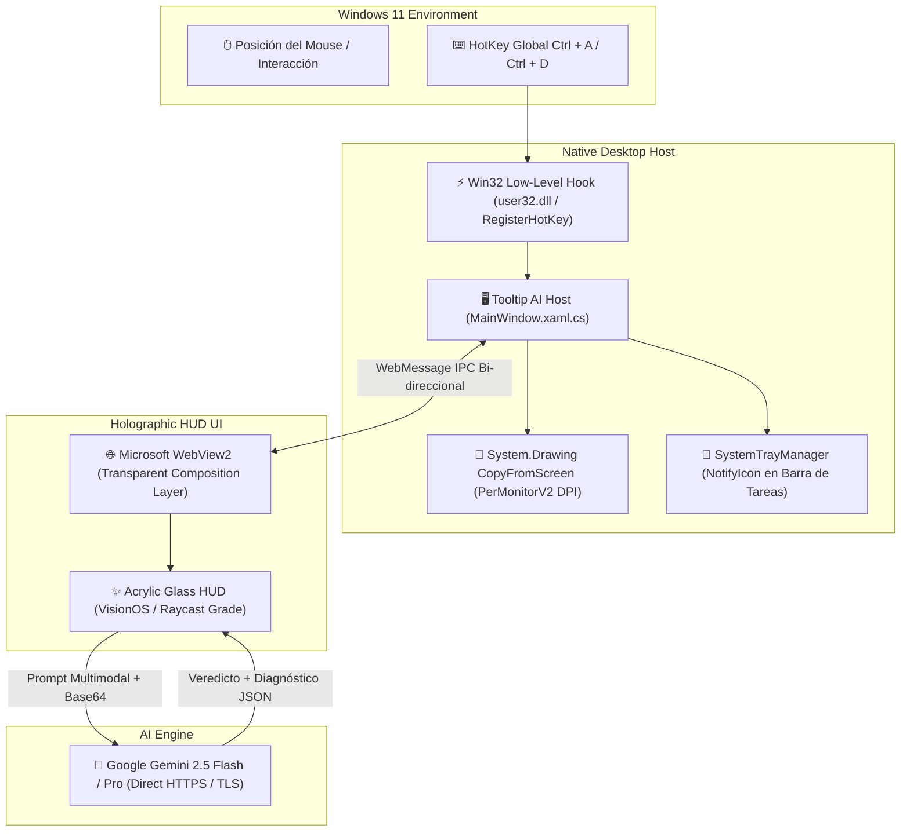

<div align="center">


# 🧠 ToolTip AI
### Inspector de pantalla con IA didáctica para Windows 11

[](https://tooltip-ai.com/)
[](https://tooltip-ai.com/)
[](https://tooltip-ai.com/downloads/ToolTipAIAssistant_1.1.8.0_x64.msix)
[](https://dotnet.microsoft.com/)
[](LICENSE)

<p align="center">
  <b>Suite nativa para Windows 11 que explica pantallas, detecta contexto por reposo, traduce interfaces y sintetiza voz con IA (tu propia clave API).</b>
</p>

</div>

---

## ⚡ Suite Oficial en Microsoft Store

La suite completa de **ToolTip AI** ya está disponible oficialmente en Microsoft Store:

| Aplicación | Función | Product ID | Enlace Store | Protocolo Directo Windows |
| :--- | :--- | :--- | :--- | :--- |
| **ToolTip AI Assistant** | Inspector de pantalla y UI con IA didáctica | `9N3D02KXKD3D` | [Ver en Store](https://apps.microsoft.com/detail/9N3D02KXKD3D) | `ms-windows-store://pdp/?productid=9N3D02KXKD3D` |
| **ToolTip AI Aura** | Dwell radar y orientación por reposo del mouse | `9P33P1P5Z8DC` | [Ver en Store](https://apps.microsoft.com/detail/9P33P1P5Z8DC) | `ms-windows-store://pdp/?productid=9P33P1P5Z8DC` |
| **ToolTip AI Translate** | Traducción on-hover con OCR e IA | `9NQN3RZ2Z655` | [Ver en Store](https://apps.microsoft.com/detail/9NQN3RZ2Z655) | `ms-windows-store://pdp/?productid=9NQN3RZ2Z655` |
| **ToolTip AI Voice** | Síntesis de voz y audio ducking WASAPI | `9P417GZB0FVB` | [Ver en Store](https://apps.microsoft.com/detail/9P417GZB0FVB) | `ms-windows-store://pdp/?productid=9P417GZB0FVB` |

### Descarga Directa (Instalador MSIX Certificado)
* 📥 **[Descargar ToolTip AI Assistant v1.1.8.0 (.msix)](https://tooltip-ai.com/downloads/ToolTipAIAssistant_1.1.8.0_x64.msix)**
* Paquetes firmados y validados para Windows 10/11 x64.

---

## 🌟 Características Principales

- **⚡ Recorte global (`Ctrl+Shift+A`):** congela la pantalla y permite seleccionar un área sin robar `Ctrl+A` (Seleccionar todo).
- **🪟 HUD flotante:** panel con veredicto, explicación en lenguaje llano, impacto y chat de seguimiento.
- **🤖 IA multi-proveedor (BYOK):** Gemini, OpenAI, Azure OpenAI, OpenRouter o Claude. Tú aportas la clave; se cifra con DPAPI local.
- **📸 Pantalla completa y portapapeles:** analiza capturas o texto copiado.
- **🔽 Bandeja del sistema:** presencia discreta; sin autoarranque forzado.
- **🔒 Clave cifrada localmente:** DPAPI de Windows (`ProtectedData`). Sin backend intermedio de capturas de Dixi3 Lqbs. El análisis va a la API de Google que configures.

---

## ⌨️ Atajos de Teclado

| Atajo | Función |
| :--- | :--- |
| <kbd>Ctrl</kbd>+<kbd>Shift</kbd>+<kbd>A</kbd> | Recorte y análisis |
| <kbd>Ctrl</kbd>+<kbd>Shift</kbd>+<kbd>D</kbd> | Radar dwell On/Off (off por defecto) |
| <kbd>Ctrl</kbd>+<kbd>Shift</kbd>+<kbd>C</kbd> | Ajustes |
| <kbd>Esc</kbd> | Cerrar / cancelar |
| **Hover (si radar activo)** | Análisis al reposar el cursor |

---

## 🏗️ Diagrama de Arquitectura


```mermaid
flowchart TD
    subgraph Windows 11 Environment
        Cursor[🖱️ Posición del Mouse / Interacción]
        Kbd[⌨️ HotKey Global Ctrl + A / Ctrl + D]
    end

    subgraph Native Desktop Host
        Hook["⚡ Win32 Low-Level Hook (user32.dll / RegisterHotKey)"]
        WPF["🖥️ Tooltip AI Host (MainWindow.xaml.cs)"]
        ScreenCap["📸 System.Drawing CopyFromScreen (PerMonitorV2 DPI)"]
        Tray["🔽 SystemTrayManager (NotifyIcon en Barra de Tareas)"]
    end

    subgraph Holographic HUD UI
        WV2["🌐 Microsoft WebView2 (Transparent Composition Layer)"]
        HUD["✨ Acrylic Glass HUD (VisionOS / Raycast Grade)"]
    end

    subgraph AI Engine
        Gemini["🤖 Google Gemini 2.5 Flash / Pro (Direct HTTPS / TLS)"]
    end

    Kbd --> Hook
    Hook --> WPF
    WPF --> ScreenCap
    WPF --> Tray
    WPF <-->|WebMessage IPC Bi-direccional| WV2
    WV2 --> HUD
    HUD -->|Prompt Multimodal + Base64| Gemini
    Gemini -->|Veredicto + Diagnóstico JSON| HUD
```

---

## 📁 Estructura del Repositorio

```text
ToolTip AI/
├── src-dotnet/                          # Aplicación de escritorio C# / .NET 8 WPF
│   ├── ToolTipAI.csproj                 # Configuración del proyecto WPF standalone
│   ├── MainWindow.xaml                  # Ventana acrílica de superposición
│   ├── MainWindow.xaml.cs               # Lógica de captura, hotkeys y WebView2 IPC
│   ├── GlobalHotKey.cs                  # Registrador de atajos de sistema Win32
│   ├── SystemTrayManager.cs             # Gestor de bandeja de sistema (System Tray)
│   ├── StartupManager.cs                # Administrador de arranque opcional en Windows
│   └── wwwroot/                         # Interfaz gráfica Fluent/VisionOS del HUD
├── MicrosoftStore_Submission/           # Kit Oficial para Microsoft Partner Center
│   ├── Package/
│   │   ├── TooltipAI.exe                # Ejecutable standalone de 72.4 MB
│   │   └── TooltipAI_1.0.0.0_x64.msix   # Paquete MSIX firmado
│   ├── Store_Assets/                    # Logos exactos (1080x1080, 2160x2160) y Screenshots
│   └── METADATOS_FICHA_TIENDA.md        # Textos y descripciones oficiales
├── downloads/
│   └── TooltipAI.exe                    # Binario servido directamente por CDN Fastly
├── index.html                           # Landing Page interactiva con simulador en vivo
├── privacy.html                         # Política de Privacidad oficial
├── LICENSE                              # Licencia MIT
└── README.md                            # Documentación del proyecto
```

---

## 🛠️ Compilación desde el Código Fuente

Si deseas compilar la aplicación tú mismo:

### Requisitos
- Windows 10 (1809+) o Windows 11.
- [.NET 8 SDK](https://dotnet.microsoft.com/download/dotnet/8.0) instalado.

### Comandos de Compilación
```powershell
# 1. Clonar el repositorio
git clone https://github.com/dixi3stdgdl-design/ToolTip-AI.git
cd "ToolTip AI"

# 2. Compilar binario autónomo de archivo único (Self-contained)
dotnet publish src/ToolTipAI.csproj -c Release -r win-x64 --self-contained true -o ./dist

# 3. Ejecutar
.\dist\TeachMeAI.exe
```

---

## 📜 Licencia y Privacidad

Distribuido bajo la Licencia **MIT**. Consulta el archivo [LICENSE](LICENSE) y nuestra [Política de Privacidad](privacy.html) para más detalles.

<div align="center">
  <sub>Desarrollado con ❤️ para los usuarios y entusiastas de Windows 11.</sub>
</div>
